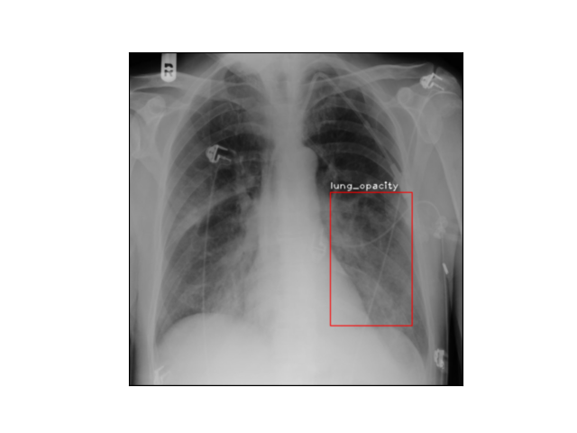
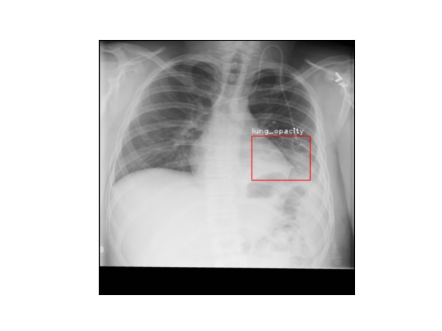
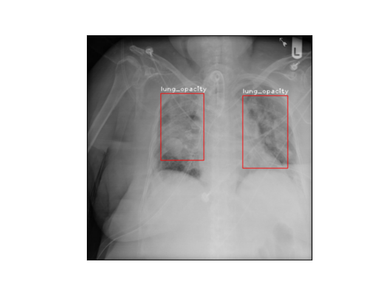

# Description

This is my implementation of a pneumonia detection model for X-ray scans of the lungs. It is based on Kaggle's [RSNA Pneumonia Detection Challenge](https://www.kaggle.com/competitions/rsna-pneumonia-detection-challenge/overview) competition. My implementation takes inspiration from the discussions among the winners of the competition [here](https://www.kaggle.com/competitions/rsna-pneumonia-detection-challenge/discussion?sort=hotness).

# Details

1) To start with the PyTorch implementation of the [Retinanet detection model](https://github.com/yhenon/pytorch-retinanet) was used.

2) The following major modifications were made to the code:
   1) **Training Data Transformations**: The original code had only the random horizontal flip transformation for the input images. Transformations like rotation, translation, scaling, and shear were added. 
   2) **Ensemble Model**: The code was modified to train an ensemble of 3 models using scikit-learn's StratifiedKFold
   3) **Regularization**: To mitigate overfitting in the detection, dropout was added in the classification part of the network.

4) Training details:
   1) Batchsize: 128
   2) Image size: 256
   3) Number of epochs: 13
   4) Optimiser: Adam, LR 1e-5 

6) Inference details:
   1) Classification score threshold (to decide whether an anchor box is a detection): 0.06
   2) Non-maximum suppression (NMS) IOU threshold: 0.1
   3) For ensembling, an IoU threshold of 0.1 was used at which boxes detected by different models were merged (by taking a weighted average of their coordinates). For bounding boxes that did not overlap between the models, a classification threshold value of 0.1 was used to decide whether the solitary box should be retained.
   4) For reasons explained further below, the true detections in the test images were systematically smaller than the ones in the training images. So after computing the detection boxes from the ensemble, every box was resized to 87.5% of its size. 

## Training

1) Create csv annotation file. Use the command:
   > python create_trainingcsv.py

2) Create the file that will contain different 'folds' for training the ensemble of models.
   > python create_folds.py --csv_file annots_file.csv --csv_classes class_list.csv

4) Start training with command:
   > python train.py --csv_file annots_file.csv --csv_classes class_list.csv  --epochs 13 --batchsize 128 --fold_no 1 --folds_path folds_train.npy

The trained models will be saved in the current directory.

## Prediction

1) Create CSV annotation file. Use the command:
   > python create_inferencecsv.py

3) For an ensemble of models, start inference with command:
   > python csv_prediction_ensemble.py --csv_classes class_list.csv --csv_test test_annots.csv --model_epoch 13 --num_images_topredict 3000 --score_threshold 0.06
   
   If predictions of only one model are required then use the command:
   > python csv_prediction.py --csv_classes class_list.csv --csv_test test_annots.csv --model <model_file.pt> --num_images_topredict 3000 --score_threshold 0.06

The CSV file containing the predictions will be created in the current directory.

## Visualise

You can visualize the model's output (saved in test_predictions.csv) by running: 
   > python visualize.py --csv_predictions test_predictions.csv --images_path /path/to/test/images  

## Results

Kaggle provided a test set of 3000 images with the correct outputs hidden. Based on the trained model's submitted predictions on the test images, Kaggle computes the Average Precision (AP), averaged for IOU thresholds ranging from 0.4 to 0.75. The Mean Average Precision (MAP) for our final ensemble model was ~0.17. 

This score is not particularly high but neither are the scores of the top scorers of the competition. A major issue is that the distribution of positive/negative images is different in the training set and the test set. In general, the statistics of the 2 datasets seem to be different (see [Inconsistencies between train dataset and test dataset](https://www.kaggle.com/competitions/rsna-pneumonia-detection-challenge/discussion/66323)). This is possibly because the method used for manually annotating the images is different for the 2 datasets as explained [here](https://www.kaggle.com/c/rsna-pneumonia-detection-challenge/discussion/64723). This essentially led to the annotations in the test dataset being systematically smaller and more in frequency as compared to the training set. When there is such a difference between the training and test dataset, a model trained well might not perform well on the test data and one is left to do only trial-and-error with different parameters in hopes of getting better test scores.

## Ideas for improvement

1) To allow the detection of smaller boxes, we can include level 2 of the Feature Pyramid Network (FPN) in the calculation of classification and regression values for each anchor box at each level.
2) A better method of ensembling might be to take the classification and regression scores of all anchor boxes of all the models in the ensemble, take the mean of each score across the models, and then use the detection threshold followed by NMS.

### Sample Images

